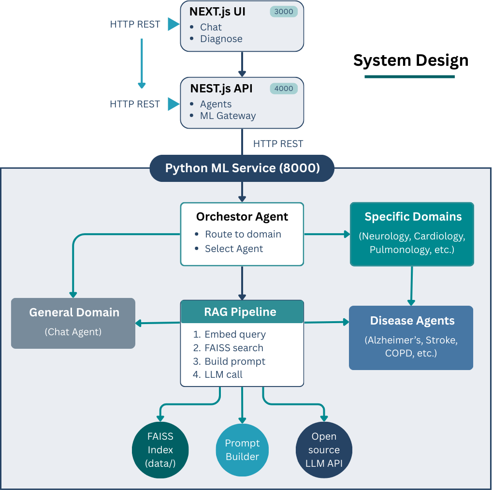

# BRAINS Platform

> Multi-Agent Medical Diagnostic System powered by RAG & LLM Inference.

[ GitHub ](https://github.com/eliteresearchlab/BRAINS)
[ Get Started ](#quick-start)

<!-- Background image (optional, nice gradient) -->

  

<!-- You can change the background color in the CSS of index.html -->